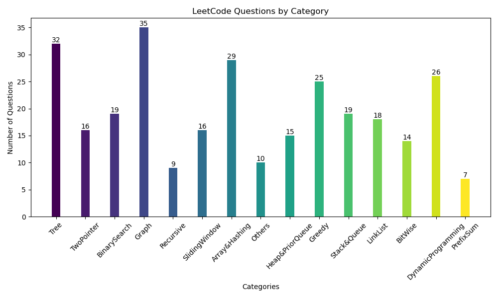
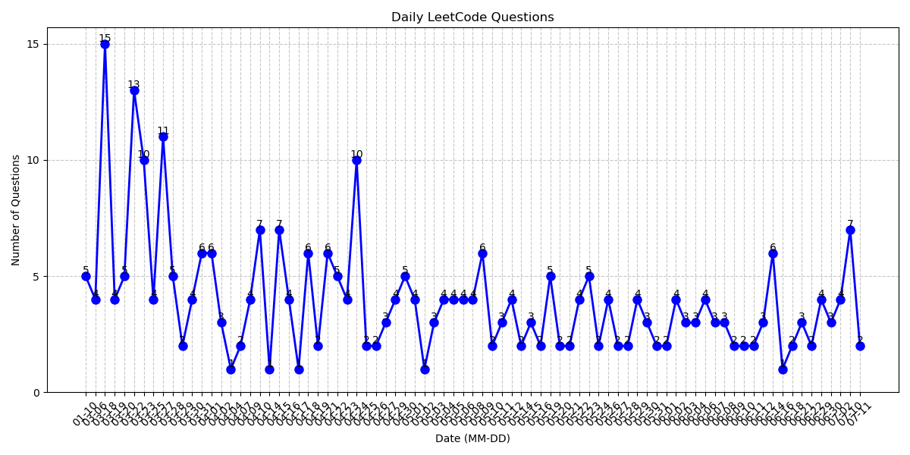

# LeetCode Problems

❌  can't resolve without solution: 31
📝  can't resolve without hint: 194
✅  resolve by self: 47
## Tree
- ❌ 105. Construct Binary Tree from Preorder and Inorder Traversal
- 📝 PrefixTree
- 📝 230.KthSmallestElementBST
- 📝 1373. Maximum Sum BST in Binary Tree
- 📝 balance
- 📝 maxDiameter
- 📝 invertBT
- 📝 remove
- 📝 sameAncestor
- 📝 SubTreeOfAnotherTree
- 📝 SameTree
- 📝 BinaryTree
- 📝 validBT
- 📝 106. Construct Binary Tree from Inorder and Postorder Traversal
- 📝 211. Design Add and Search Words Data Structure
- 📝 450.DeleteNodeInBST
- 📝 levelOrder
- 📝 Depth
- 📝 94.inorderTraversal
- 📝 671. Second Minimum Node In a Binary Tree
- ✅ 1382. Balance a Binary Search Tree
- ✅ 124. Binary Tree Maximum Path Sum
- ✅ 1325. Delete Leaves With a Given Value
- ✅ 988. Smallest String Starting From Leaf
- ✅ 297. Serialize and Deserialize Binary Tree
- ✅ insertBinaryTree
- ✅ 1448.CountGoodNodesInBinaryTree
- ✅ 199.BinaryTreeRightSideView
- ✅ 427. Construct Quad Tree

## TwoPointer
- ❌ 838. Push Dominoes
- 📝 validParlindrome2
- 📝 42. Trapping Rain Water
- 📝 189. Rotate Array
- 📝 mergeSortArray
- 📝 waterContainer
- 📝 481. Magical String
- 📝 26. Remove Duplicates from Sorted Array
- 📝 3sum
- 📝 twoSum2
- 📝 validParlindrome
- ✅ reverseStr
- ✅ mergeStr
- ✅ 881. Boats to Save People

## BinarySearch
- ❌ 2071. Maximum Number of Tasks You Can Assign
- ❌ 81. Search in Rotated Sorted Array II
- ❌ 2616. Minimize the Maximum Difference of Pairs
- 📝 69. Sqrt(x)
- 📝 findMinRotatArr
- 📝 34. Find First and Last Position of Element in Sorted Array
- 📝 1011. Capacity To Ship Packages Within D Days
- 📝 EatBanans
- 📝 SearchInsertPos
- 📝 Search2D
- 📝 1300. Sum of Mutated Array Closest to Target
- 📝 278. First Bad Version
- 📝 RotateSortArrSearch
- 📝 CountNumberOfFairPairs
- 📝 981. Time Based Key-Value Store
- 📝 BinarySearch
- ✅ 852. Peak Index in a Mountain Array
- ✅ 167. Two Sum II - Input Array Is Sorted
- ✅ 1095. Find in Mountain Array

## Graph
- ❌ 1857. Largest Color Value in a Directed Graph
- ❌ islandTreasure
- ❌ 1579. Remove Max Number of Edges to Keep Graph Fully Traversable
- 📝 1584. Min Cost to Connect All Points
- 📝 3342. Find Minimum Time to Reach Last Room II
- 📝 2359. Find Closest Node to Given Two Nodes
- 📝 Number of Connected Components in an Undirected Graph
- 📝 GraphValidTree
- 📝 cloneGraph
- 📝 909. Snakes and Ladders
- 📝 SurroundedRegions
- 📝 CourseSchedule
- 📝 684. (UnionFind)Redundant Connection
- 📝 PacificAtlanticWaterFlow
- 📝 isoLand
- 📝 133. Clone Graph
- 📝 3249. Count the Number of Good Nodes
- 📝 778. Swim in Rising Water
- 📝 743.NetworkDelayTime
- 📝 841. Keys and Rooms
- 📝 3372. Maximize the Number of Target Nodes After Connecting Trees I
- 📝 210.CourseSchedule2
- 📝 1061. Lexicographically Smallest Equivalent String
- 📝 3373. Maximize the Number of Target Nodes After Connecting Trees II
- 📝 386. Lexicographical Numbers
- 📝 maxLand
- 📝 3341. Find Minimum Time to Reach Last Room I
- 📝 rottingFruit
- ✅ 3015. Count the Number of Houses at a Certain Distance I
- ✅ 547. Number of Provinces
- ✅ 1298. Maximum Candies You Can Get from Boxes
- ✅ 463. Island Perimeter
- ✅ Alien Dictionary

## Recursive
- 📝 wordSearch
- 📝 Subsets
- 📝 Subset2
- 📝 131. Palindrome Partitioning
- 📝 combinationSum2
- 📝 permutation
- 📝 combinationSum
- ✅ 17. Letter Combinations of a Phone Number
- ✅ countAndStay

## SlidingWindow
- ❌ 2444.CountSubarraysWithFixedBounds
- 📝 567. Permutation in String
- 📝 LRCR
- 📝 1438. Longest Continuous Subarray With Absolute Diff Less Than or Equal to Limit
- 📝 76. Minimum Window Substring
- 📝 2302.CountSubarraysWithScoreLessThanK
- 📝 LGS
- 📝 containDuplicate2
- 📝 2009. Minimum Number of Operations to Make Array Continuous
- 📝 3392.CountSubarraysofLengthThreeWithaCondition
- 📝 2962. Count Subarrays Where Max Element Appears at Least K Times
- 📝 643.MaximumAverageSubarray
- 📝 BuySellStock
- ✅ 209. Minimum Size Subarray Sum
- ✅ 2958. Length of Longest Subarray With at Most K Frequency

## Array&Hashing
- ❌ LongestConsecutiveSeq
- 📝 designHashset
- 📝 concateArr
- 📝 longCommonStr
- 📝 2131. Longest Palindrome by Concatenating Two Letter Words
- 📝 CountGoodTriple
- 📝 ValidAnagram
- 📝 removeElement
- 📝 2sum
- 📝 442. Find All Duplicates in an Array
- 📝 1399.CountLargestGroup
- 📝 2145.CounttheHiddenSequences
- 📝 TopKFreq
- 📝 2799ountCompleteSubArr
- 📝 EdString
- 📝 169.majorityElement
- 📝 1920. Build Array from Permutation
- 📝 hashtable
- 📝 DuplicateArray
- 📝 anagramGroup
- 📝 ProductsArrayExceptSelf
- ✅ valideSudoku
- ✅ countEqualAndDivisiblePairs
- ✅ 128. Longest Consecutive Sequence
- ✅ 1128. Number of Equivalent Domino Pairs

## Others
- ❌ 2013. Detect Squares
- ❌ 2845.CountofInterestingSubarrays
- ❌ 54. Spiral Matrix
- ❌ 1851. Minimum Interval to Include Each Query
- 📝 matrixZero
- 📝 multiStr
- 📝 Meeting Rooms II
- 📝 meetingTime
- 📝 1895. Largest Magic Square
- 📝 plusOne
- 📝 mergeInterval
- 📝 168.ExcelSheetColumnTitle
- 📝 insertInterval
- ✅ 435.Non-overlappingIntervals
- ✅ 1295. Find Numbers with Even Number of Digits
- ✅ 48.rotateImg

## Heap&PriorQueue
- ❌ 621. Task Scheduler
- ❌ 3362. Zero Array Transformation III
- 📝 295. Find Median from Data Stream
- 📝 KclosePoint
- 📝 355. Design Twitter
- 📝 customCmp
- 📝 smashStone
- 📝 855. Exam Room
- 📝 heapsort
- 📝 KthLargestElementInArray
- ✅ reorganizeString
- ✅ 3170. Lexicographically Minimum String After Removing Stars
- ✅ 2342. Max Sum of a Pair With Equal Sum of Digits
- ✅ KthLargestElement 

## Greedy
- ❌ MergeTripletsFormTarget
- ❌ 3577. Count the Number of Computer Unlocking Permutations
- 📝 2434. Using a Robot to Print the Lexicographically Smallest String
- 📝 135. Candy
- 📝 jumpGame
- 📝 763. Partition Labels
- 📝 1007. Minimum Domino Rotations For Equal Row
- 📝 678. Valid Parenthesis String
- 📝 gasStation
- 📝 781.RabbitForest
- 📝 860.LemonadeChange
- 📝 jumpGame2
- 📝 2918. Minimum Equal Sum of Two Arrays After Replacing Zeros
- 📝 maxSubarray
- 📝 846.HandofStraights
- ✅ 3170. Lexicographically Minimum String After Removing Stars
- ✅ 658. Find K Closest Elements
- ✅ 2566. Maximum Difference by Remapping a Digit

## Stack&Queue
- ❌ 1425. Constrained Subsequence Sum
- ❌ largestRectangleHistogram
- 📝 dailyTemperature
- 📝 223.implementQueuewithStack
- 📝 1438. Longest Continuous Subarray With Absolute Diff Less Than or Equal to Limit
- 📝 ValidParentheses
- 📝 Resulting String After Adjacent Removals
- 📝 ReversePolishNotation
- 📝 2696. Minimum String Length After Removing Substrings
- 📝 239. Sliding Window Maximum
- 📝 carfleet
- 📝 generateParentheses
- 📝 MinStack
- 📝 496. Next Greater Element I
- ✅ 225.implementStackwithQueue
- ✅ 901. Online Stock Span
- ✅ baseBallGame
- ✅ 735. Asteroid Collision

## LinkList
- ❌ duplicateNumber
- ❌ 1171. Remove Zero Sum Consecutive Nodes from Linked List
- ❌ 25. Reverse Nodes in k-Group
- 📝 basic
- 📝 merge
- 📝 138opyWithRandomPointer
- 📝 reorder
- 📝 817. Linked List Components
- 📝 622. Design Circular Queue
- 📝 23.mergeKSortList
- 📝 LRUcache
- 📝 reverse
- 📝 234.PalindromeLinkedList
- 📝 removeFromEnd
- 📝 circle
- 📝 92.reverse2
- 📝 addTwoNums
- ✅ 2074. Reverse Nodes in Even Length Groups

## BitWise
- ❌ 29. Divide Two Integers
- 📝 reversebit
- 📝 67. Add Binary
- 📝 getSum
- 📝 1922.CountGoodNumbers
- 📝 reverseInt
- 📝 SingleNum
- 📝 2857. Count Pairs of Points With Distance k
- 📝 #OneBits
- 📝 CountingBits
- 📝 201. Bitwise AND of Numbers Range
- 📝 MissingNumber
- ✅ 1863.SumofAllSubsetXORTotals
- ✅ 2527. Find Xor-Beauty of Array

## DynamicProgramming
- ❌ 300. Longest Increasing Subsequence
- ❌ 5.LPS
- ❌ 1857. Largest Color Value in a Directed Graph
- ❌ 72. Edit Distance
- ❌ 152. Maximum Product Subarray
- 📝 coinChange
- 📝 LCS
- 📝 houseRobber
- 📝 97. Interleaving String
- 📝 PartitionEqualSubsetSum
- 📝 790. Domino and Tromino Tiling
- 📝 309. Best Time to Buy and Sell Stock with Cooldown
- 📝 91.DecodeStr
- 📝 2901. Longest Unequal Adjacent Groups Subsequence II
- 📝 LongestIncreasingPathMatrix
- 📝 houseRobber2
- 📝 10. Regular Expression Matching
- 📝 494. Target Sum
- 📝 climbStair
- 📝 518oinChange2
- 📝 647.PalindromicSubstrings
- 📝 2338.CountTheNumberOfIdealArrays
- 📝 minCostClimb
- ✅ uniquePath
- ✅ 139. Word Break

## PrefixSum
- ❌ 3355. Zero Array Transformation I
- ❌ 3356. Zero Array Transformation II
- 📝 1838. Frequency of the Most Frequent Element
- 📝 1664. Ways to Make a Fair Array
- 📝 2574. Left and Right Sum Differences

## Statistics
Current total questions: 269

