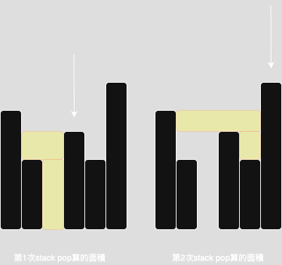

# Stack

常見特徵

1. 字串中有括號、需要配對：如有效括號問題。
2. 遇到某個元素需要「回頭看」前一個元素。
3. 模擬一個 操作過程，像是 undo 或瀏覽器的 back 功能。

## Monotonic Stack

1. 需要往前或是往後尋找，下一個比自己大或比自己小的元素就可以使用 monotonic stack

2. stack 中保持著一定的順序，例如遞增或是遞減。

3. 如果要新增的 element 比 top 還大/小。就把 top pop 出去。然後繼續往下比，直到保持一定的遞增或是遞減的順序。**通常是找序列中比自己後面，但是值比自己還大/小的題目**。

## Monotonic Queue

相較於 monotonic stack 也有保持遞增/遞減, 並且可以從 front 移除過期元素 1425. Constrained Subsequence Sum.cpp

### 42. Trapping Rain Water

monotonic stack 每次遇到 h[i] > stack.top, 就不斷 pop 然後看 min(left_wall,
right_wall)去算這個 bar 儲水量 stack 存的是 index, 因為也要計算 weight

